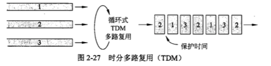

带宽有限的信号
- 无强衰减（1/2衰减）的发射频率范围，f2-f1，单位为*HZ*。
- 数据发送率：单位是*bps* 或 *b/s*。

波特(*baud*) 和 比特率(*bit rate*)
- 每秒采样数以波特为单位，在每个波特期间，发送一个信号(symbol)
- 在信息传输通道中，携带数据信息的信号单元叫 *码元*，每秒钟通过信道传输的码元数称为码元传输速率，简称**波特率**。
- 每秒钟通过信道传输的信息量称为位传输速率，也就是每秒钟传送的二进制位数,简称**比特率**。
- 比特率 = 波特率 * 单个调制状态对应的二进制位数
- 设一个码元(*Singal*)可携带4bit的信息,一个标准电话话路 (带通矩形特性)的带W=3100 Hz, 采用2400HZ的正弦波为载波来调制数据，则信息的传输速率为2400 Baud ，对应的比特率为:`2400 Hz * 4bit = 9600b/s`
- 当采用16元制调制方法时,一个码元可携带4bit的信息。

信道(channel)的最大数据速率
- **奈奎斯特理论**：最大数据速率b/s = $2Hlog_2V$，H带宽，V离散等级，低通，无噪声，理想通道。
- 信噪比(S/N)，信号功率与噪声功率的比值，表示为对数形式，单位为分贝(DB) = $10log_1$$_0$$S/N$
- **香农理论**：最大数据速率或容量b/s = $Hlog_2(1+S/N)$，告诉了我们实际信道能获得的最大容量。

-------------------------------------------------------------------------

传输介质：
- 磁介质(*magnetic media*)
- 双绞线和非屏蔽双绞线(*UTP*)，单位长度内缠绕得更紧可以导致更少的串扰
- 同轴电缆(*coaxial cable*)
- 光纤(*Fiber Optics*)
  - 多模光纤(*multimode fiber*)
  - 单模光纤(*singlemode fiber*)
  - 光的衰减：输入输出信号的比值，用分贝表示为$10log_1$$_0$$(transmitted power/received power)$
  - 目前使用的波长：0.85μm，1.3μm，1.55μm
  - 光缆：连接器(connector)，机械， 融合(melt)
    - 半导体光源和**LED光源**（除了贵啥都好）

-------------------------------------------------------------------------

概念：
- 电磁波每秒振动的次数称为它的**频率** (*frequency*)，通常用f表示，以赫兹(Hz)来度量(以此纪念物理学家赫兹)。
- 两个相邻的波峰(或者波谷)之间的距离称为**波长**(wavelength)，通常用希腊字母 λ表示。
- 真空光速c：$λf=c$

无线传输：
- 电磁频谱(*Electromagnetic Spectrum*)
  - 低频(LF)、中频(MF)、高频(HF)
  - 甚高频(VHF)、超高频(UHF)、特高频(SHF)、极高频(EHF)、巨高频(THF)
- 无线电传输(*Radio Transmission*)
- 微波传输(*Microwave Transmission*)
- 红外传输
- 光通信

-------------------------------------------------------------------------

通带传输：
- 星座图：黑点给出了每个符号合法的振幅和相位结合，一个点的相位是以它为起点到原点的线与 x 正轴 之间的角度来表示，一个点的振幅则是该点到原点的距离。

-------------------------------------------------------------------------

**频分复用**(*Frequency-division multiplexing*, FDM)
- 利用通带传输的优势使多个用户共享一个信道。它将频谱分成几个频段，每个用户完全拥有其中的一个频段来发送自己的信号。
- 比语音通信所需多出来的那部分频带称为**保护带**(guard band)，它使信道之间完全隔离。
- 即使信道之间有保护带形成的问隔，相邻信道之间仍然可能 存在某种重叠。

**时分复用**(*Time-division multiplexing*, TDM)
- 用户以循环的方式轮流工作。，个用户周期性地获得**整个带宽**非常短的一个时间。
- 三个流通过 TDM 复用的示例。每个输入流的比特从一个固定的时间槽( *time slot*)取出并输出到混合流。该混合流以各个流速率的总和速度发送。这种工作方式要求输入流在时间上必须同步。类似于频率保护带，为了适应时钟的微小变化可能要增加**保护时间**( *guardtime* )间隔。

**码分复用**(*Code-division multiplexing*, CDM)
- 扩展频谱(* spread spectrum*)通信的一种形式，它把一个窄带信号扩展到一个很宽的频带上。
- 这种方法更能容忍干扰，而且允许来自不同用户的多个信号共享相同的频带，码分多址(*CDMA, Code Division Multiple Access*)
- CDMA 允许每个站利用整个频段发送信号，而且没有任何时间限制。
- 在 CDMA 中，每个比特时间被再细分成 m 个更短的时间间隔，这更短的时间间隔就称为**码片**(*chip*)。
- 除了蜂窝网络， CDMA 还被用于卫星通信和有线电视网络。

