1. 数据链路层使用物理层提供的服务在通信信道上发送和接收比特。

2. 功能：
- 向网络层提供一个定义良好的服务接口。
- 处理传输错误。(错误控制)
- 调节数据流，确保慢速的接收方不会被快速的发送方淹没。(流量控制)

3. 数据包和帧(*frame*)的关系：

数据链路层从网络层获得数据包，然后将这些数据包封装成帧(*frame*)以便传输。每个帧包含一个帧头、一个有效载荷(用于存放数据包〉以及一个帧 尾，如图 3-1 所示。帧的管理构成了数据链路层工作的核心。

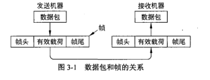

4. 数据链路层的功能是**为网络层提供服务**。最主要的服务是**将数据从源机器的网络层传输到目标机器的网络层。**链路层对帧通常有严格的长度限制，这是由硬件所决定的；除此之外，还有传播延迟。

一般情况下，数据链路层通常会提供以下 3 种可能的服务:
- 无确认的无连接服务：源机器向目标机器发送独立的帧，目标机器并不对这些帧进行确认。
  - 适合错误率很低的场合，错误恢复过程可以留给上层来完成。
  - 实时通信，如语音传输，因为此时数据迟到比数据受损更糟。
- 有确认的无连接服务
  - 发送的每一帧需要单独确认，发送帧可以知道是否正确到达目标，若是超时未到达，将再次发送该帧。
  - 尤其适用于不可靠的信道，如无线系统，Wi-Fi就是很好的例子。
- 有确认的有连接服务
  - 建立一个连接
  - 每一帧都被编号
  - 确保每一帧都会被接受
  - 每个帧只被接受一次
  - 所有帧按正确顺序被接受适用于长距离且不可靠的链路，如卫星通讯或者长途电话
  - 最后，连接会被释放

5. 数据链路层必须使用物理层提供给它的服务。检测错误和纠正错误(有必要的话)的工作正是数据链路层该做的。

通常的做法是将比特流拆分成多个离散的帧，为每个帧计算一个称为**校验和(*checksum*)**的短令牌(后面讨论校验和算法)，并将该校验和放在帧中一起传输。 <br>
当帧到达目标机器时，要重新计算该帧的校验和。<br>
如果新算出来的校验和与该帧中包含的校验和不同，则数据链路层知道传输过程中产生了错误，它就会采取措施来处理错误〈比 如丢掉坏帧，可能还会发回一个错误报告〉。<br>
拆分比特流的方法:
- 字节计数法(*character count*)
- 字节填充的标志字节法(*Byte Stuffing or character stuffing*)
- 比特填充的标志比特法(*bit stuffing*)
- 物理层编码违禁法(*physical layer coding violation*)

6. 字节计数法(*character count*)

利用头部中的一个字段来标识该帧中的字符数，当接收方的数据链路层看到字符计数值时，它就知道后面跟着多少个字节，因此也就知道了该帧在哪里结束。

7. 字节填充的标志字节法(*Byte Stuffing or character stuffing*)

这种方法考虑到了出错之后的重新同步问题，它让每个帧用一些特殊的字节 为开始和结束。这些特殊字节通常都相同，称为**标志字节**(*flag byte*)，作为帧的起始和结束分界符。因此，如果接收方丢失了同步，它只需搜索两个标志字节就能找到当前帧的结束和下一帧的开始位置。

当标志字节出现在数据中时，**尤其是当传输二进制数据 (比如照片或歌曲〉时，这种情景往往会严重干扰到帧的分界**。

字节填充( *byte stuffing*)：<br>
有一种方法可以解决这个问题，发送方的数据链路层在数据中“偶尔”出现的每个标志字节的前面插入一个特殊的转义字节(*ESC*)。因此，只要看它数据中标志字节的前面有没有转义字节，就可以把作为帧分界符的标志字节与数据中出现的标志字节区分开来。**接收方的数据链路层在将数据传递给网络层之前必须删除转义字节**。

如果转义字节也出现在数据中，那该怎么办?<br>
答案是同样用字节填充技术，即用一个转义字节来填充。*在接收方，第一个转义字节被删除，留下紧跟在它后面的数据字节(或许是另一个转义字节或者标志字节)*。

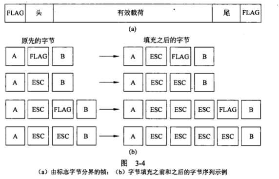

8. 比特填充的标志比特法(*bit stuffing*)

- **只能使用 8 比特的字节**。
- 每个帧的开始和结束由一个特殊的比特模式， `01111110` 或十六进制`Ox7E` 标记。
- 这种模式是一个标志字节。每当发送方的数据链路层在数据中遇到连续五个1，便自动在输出的比特流中填入一个比特 0。
- USB (通用串行总线)采用了比特填充技术。
- 当接收方看到 5 个连续入境比特 1，并且后面紧跟一个比特 0，它就自动剔除(即删除)比特 0。
- 比特填充和字节填充一样，对两台计算机上的网络层是完全透明的。
- 如果接收方失去了它的接收轨迹，它所要做的只是扫描输入比特流，找出其中的标志序列。

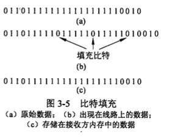

9. 差错控制(*Error Control*)

- Error detection
- Error correction
- Repeated data frame
- Lost frame
- Timer
  - 计时器的超时值应该设置得足够长，以便保证在正常情况下该帧能够到达接收方，并且在接收方进行处理后再将确认返回到发送方。
  - 一般有必要给发送出去的帧分配序号，这样接收方可以根据帧的序号来有效区分原始帧和重传帧。

10. 流量控制(*Flow Control*)

发送方发送帧的速度超过了接收方能够接受这些帧的速度。
- 基于反馈的流量控制(*feedback-based flow control*): 接收方给发送方返回信息，允许它发送更多的数据。
- 基于速率的流量控制(*Crate-based flow control*): 限制发送方传输数据的速率，而无须利用接收方的反馈信息。

11. 差错检测和纠正

- 纠错码(*error-correcting code*)：每一个被发送的数据块中包含足够多的冗余信息。
- 检错码 (*error-detecting code*)：包含一些冗余信息，但这些信息只能让接收方推断出是否发生了错误。

|纠错码|
|:------:|
|海明码|
|二进制卷积码|
|里德所罗门码|
|低密度奇偶校验码|

一帧由m个数据位(即信息)和r个元余位(即校验)组成。

海明距离(*Hamming distance*)：两个码字中不相同的位的个数。

`10001001 xor 10110001=>00111000 Hamming distance=3`

Hamming distance of a codewords list: 找到两个codewords之间海明距离最小。
```
0000000000, 0000011111, 1111100000, and 1111111111
This list has a distance 5

D(a,c) <= D(a,b) + D(b,c),here D(x,y)is the Hamming distance of codeword x and y
```

纠正d比特需距离为2d+1比特的编码
- 0000000000，0000011111，1111100000，and 1111111111
- 该编码方案的距离是 5，这意味着它可以纠正 2 个错误或者检测双倍的错。
- 0000000000 error => 1100000000


|检错码|
|:------:|
|奇偶|
|校验和|
|循环元余校验 (*CCRC*)|
||

循环冗余校验码 (*CCRC, Cyclic Redundancy Check*)，也称为多项式编(*polynomial code*)。

多项式编码的基本思想是:
- 将位串看成是系数为 0或 1 的多项式。 
- 一个k位帧看作是一个 k-1 次多项式的系数列表，该多项式共有k项，从 $x^k-1$到$x^0$。这样的多项式认为是 k-1 阶多项式。
- 高次(最左边〉位是$x^k-1$项的系数，接下来的位是$x^k-2$ 的系数，依此类推。
- 例如 110001 有 6 位，因此代表了一个有 6 项的多项式，其系数分别 为 1、 1、 0、 0、 0 和 1: 即$1x^5+1x^4+0x^3+0x^2+0x^1+1x^0$。
- 多项式的算术运算遵守代数域理论规则，以 2 为模来完成。加法没有进位，减法没有借位。加法和减法都等同于异或。例如:

```
  10011011         00110011
- 11001010        +11001101
-------------    ------------
  01010001         11111110
```

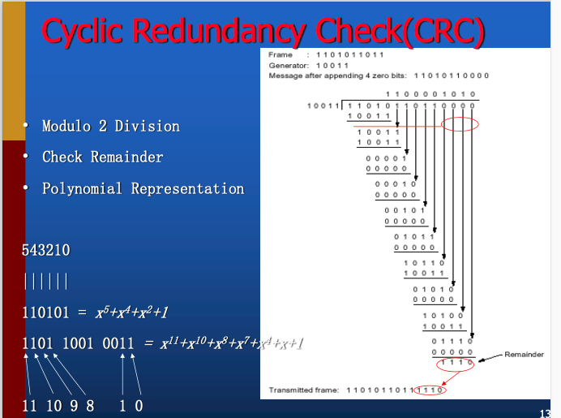

12. 停止等待协议

发方每发送一帧就暂停,等待应答(ACK)到来。收方收到数据帧后发ACK帧给发方，发方再发送下一个数据帧。

要解决的问题-[fig lk3-3]
- DATA帧出错
  - 对策:收方用NAK应答。
- DATA帧丢失
  - 对策:使用定时器及重发。
- 收方收到重复的DATA帧
  - 对策:帧编号:0，1，0，1...。


13. 基本数据链路层协议

wait_for_event(&event), 3 events:
- frame_arrival: Received correct frame.
- cksum_err: Received frame with checksum error.
- timeout: timeout when sender waits acknowledgement

为什么网络层永远得不到任何帧头的信息，理由非常简单，那就是要保持网络层和数据链路层的完全分离。只要网络层对数据链路协议和帧格式一无所知，那么当数据链路协议和帧格式发生变时，网络层软件可以不作任何改变。每当一块新 NIC 安装在计算机上时这种情况就会发生。

* 无错信道上的单工停-等式协议：<br>
发送方网络层无限制的数据传输，信道永不损坏或丢失。<br>
丢弃限制条件：接收器的网络层可以接收无限的数据。

* 有错信道上的单工停-等式协议

如果在一个协议中，发送方在前移到下一个数据之前必须等待一个肯定确认，这样的协议称为自动重复请求(*ARQ , Automatic Repeat reQuest*)或带有重传的肯定确认( *PAR, Positive Acknowledgement with Retransmission*)。

当发送方和接收方的数据链路层处于等待状态时，两者都用一个变量记录下了有关的值。发送方在 `next frame to send` 中记录了下一个要发送的帧的序号:接收方则在`frame_expected` 中记录了下一个期望接收的序号。每个协议在进入无限循环之前都有一个简短的初始化阶段。

发送方在发出一帧后启动计时器。如果计时器己经在运行，则将它重置，以便等待另一个完整的超时时间间隔。

当一个有效帧到达接收方时，接收方首先检查它的序号，确定是否为重复数据包。如果不是，则接受该数据包并将它传递给网络层，然后生成二个确认帧。

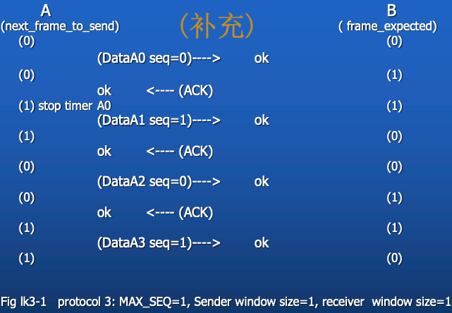
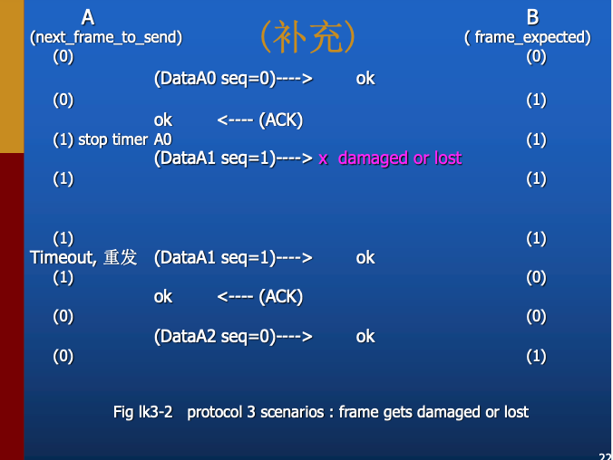
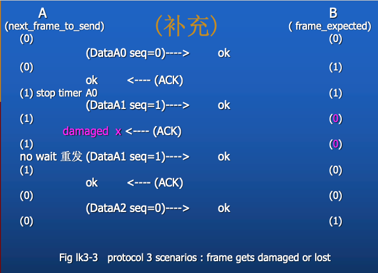
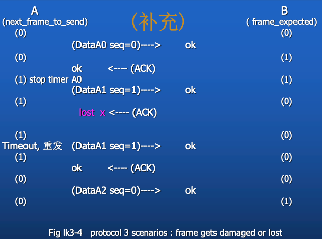

14. 滑动窗口协议

* 双向传输
* 暂时延缓确认以便将确认信息搭载在下一个出境数据帧上的技术就称为捎带确认 (*piggybacking*)。[使用帧头的ack字段]
  * 更好地利用了信道的可用带宽。

双向协议，在这 3 个协议中，任何一个出境帧都包含一个序号， 范围从 0 到某个最大值。序号的最大值通常是 $2^n一1$，这样序号正好可以填入到一个 n 位的 字段中。<br>
停-等式滑动窗口协议使用 $n=1$，限制了序号只能是 0 和 1，但是更加复杂的协议版本可以使用任意的n。

* 1 位滑动窗口协议

所有滑动窗口协议的本质是**在任何时刻发送方总是维持着一组序号**，分别对应于允许它发送的帧，我们称这些帧落在发送窗口(*sending window*)。

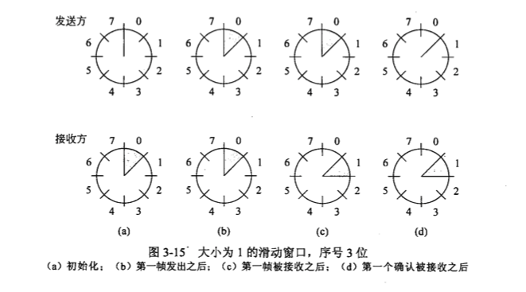

在一般情况下，两个数据链路层中的某一个首先开始，发送第一帧。

当该帧(或者任何其他帧)到达目的地，接收方的数据链路层检查该帧，看它是否为重复帧，如同协议 3 一样。如果这帧正是接收方所期望的，则**将它传递给网络层**，井且接收方的窗口向前滑动。

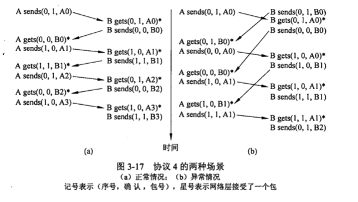

* 回退 N 协议

这个方案的基本思想是允许发送方在阻塞之前发送多达 w 个帧，而不是一个帧。通过选择足够大的 w 值，发送方就可以连续发送帧，因为在发送窗口被填满之前前面帧的确认就返回了，因而防止了发送方进入阻塞。

这种容量由比特/秒的带宽乘以单向传送时间所决定，或数据链路层有责任以链路的**带宽-延迟乘积** (*bandwidth-delay product*)序列把数据包传递给网络层。

我们可以将这个数量拆分成一帧的比特数，从而用帧的数量来表示。我们将这个数值称为**BD**。因此, w应设置为`2BD+1`。

具有 50 kbps 的带宽和 250 毫秒的单向传输时间，带宽-延迟乘积为2.5kb 或 12.5个长度为 1000位的帧。因此，2BD+1 是 26 帧。

我们可以将链路利用率表示成发送方未被阻塞的时间比例:

$链路利用率<=w/(1+2BD)$

位于某个数据流中间的一个帧被损坏或丢失，会发生什么事情?<br>
**在发送方发现问题之前大量的后续帧已经发出，并且即将到达接收方**。<br>
当损坏的那个帧到达接收方时，显然它应该被丢弃，但接收方该如何处理 所有那些后续到达的正确帧呢?<br>请记住，接收方的数据链路层有责任按正确的顺序把数据包传递给网络层。

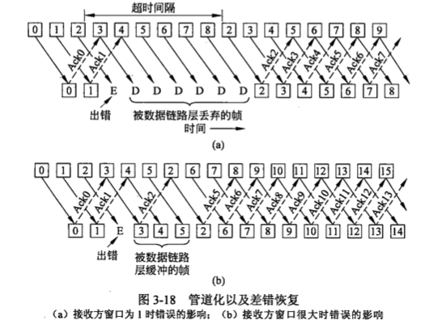

> 0 号帧和 1号帧被正确接收，并得到确认; 2号帧丢失了。当3号帧到达接收方时，那里的数据链路层注意到自己错过了一帧，所以它针对错失的 2 号帧返 回一个 NAK，但是将第 3 帧缓存起来。当 4 号和 5 号帧到达之后，它们也被数据链路层缓存起来，而没有被传递给网络层。 2号帧的 NAK抵达发送方后，发送方立即重传2号帧。 当该帧到达接收方时，数据链路层现在有了 2 号、 3 号、 4 号和 5 号帧，于是就将它们按照正确的顺序传递给网络层，也可以确认所有这些帧(从 2 号帧到 5 号帧)，如图中所示。如果 NAK 被丢失，则发送方的 2 号帧计时器最终超时，发送方就会重新发送 2 号帧(仅仅这一帧〉，但是，这可能已经过了相当长一段时间。

(1) 回退n(*go-back-n*)

接收方只需简单丢弃所有到达的后续帧，而且针对这些丢弃的帧不返回确认。这种策略对应于**接收窗口大小为 1 **的情形。

由于发送方可能必须在将来的某个时间重新发送所有未确认的帧，因此它必须缓冲所有已发送的帧，直到确认到达为止。

- 未确认帧的最大数目必须限制为不能超过 `MAX_SEQ`。
- 发送窗口不大于`MAX_SEQ`。
- 累计确认(*cumulative acknowledgement*)
  - 由于发 送方可能在将来的某个时刻要重传所有未被确认的帧，所以，它必须把己经发送出去的帧一直保留，直到它能肯定接收方已经接受了这些帧。当 n 号帧的确认到达， n-1 号帧、 n-2 号帧等都会自动被确认。
  - 只需使用一个硬件时钟，它周期性地引发中断。所有未发生的超时事件构成了一个链表，链表中的每个节点包含了离超时还有多少小时钟滴答、超时对应 的那个帧，以及一个指向下一个节点的指针。

(2) 选择重传(*selective repeat*)。

- 允许接收方接受并缓存坏帧或者丢失帧后面的所有帧。
- 发送方和接收方各自维持一个窗口，该窗口分别包含可发送或己发送但未被确认的和可接受的序号。
  - 发送方的窗口大小从 0 开始，以后可以增大到某一个预设的最大值。
  - 接收方的窗口总是固定不变，其大小等于预先设定的最大值。
- 接收方为其窗口内的每个序号保留一个缓冲区。与每个缓冲区相关联的还有一个标志位(*arrived*), 用来指明该缓冲区是满的还是空的。
- 每当到达一帧，接收方通过 between 函数检查它的序号，看是否落在窗口内。
  - 如果确实落在窗口内，并且以前没有接收过该帧，则接受该帧，并且保存在缓冲区。
  - 不管这帧是否包含了网络层所期望的下一个数据包，这个过程肯定要执行。当然，该帧只能被保存在数据链路层中，直到所有序号比它小的那些帧都己经按序递交给网络层之后，它才能被传递给网络层。


- 对于不按序到达的帧，不丢弃，而是保存起来，等所缺的帧到达后，把保存起来的那些顺序正确的多个帧一并上交。
- 接收窗口的大小要等于发送窗口的大小;
- 对于3 bit序号值，序号范围为 0－7，即MAX_SEQ=7,发送窗口的大小为`(MAX_SEQ+1)/2=4`，接受窗口的大小＝4。
- 发送窗口的大小不能大于`(MAX_SEQ+1)/2`，这里是4（设MAX_SEQ＝7），否则应答(ack)丢失的情况，二者的窗口会有重叠部分。

- 如果发送窗口的大小是4或更小，则问题解决：
- A的发送窗口＝[0,1,2,3], B的接收窗口＝[0,1,2,3]
- A向B发送 0、1、2、3＃帧，两种不同的情况发生了：
  - 情况1：B收到全部4个帧，应答也全部被A收到；
    - A新的发送窗口＝[4，5，6，7]
    - B新的接收窗口＝[4，5，6，7]
    - 新发4，5，6，7＃帧；
  - 情况2：4个帧全部收到，但应答全部丢失
    - A的发送窗口＝[0,1,2,3]
    - B的接收窗口＝[4，5，6，7]
    - A重发0＃帧；
- 没问题：新来的0＃帧不在接收窗口内，是重发的，应丢弃。


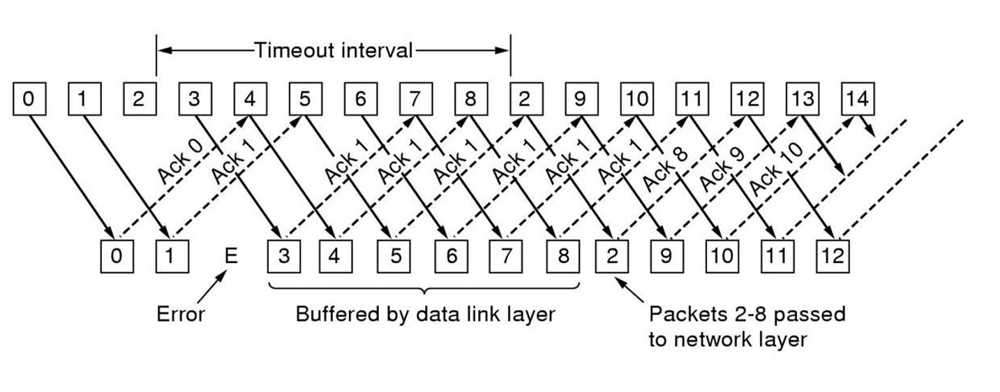