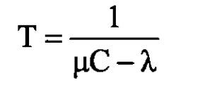
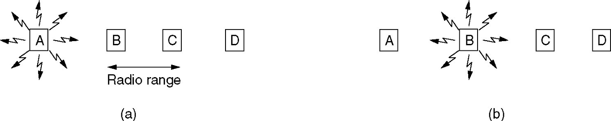
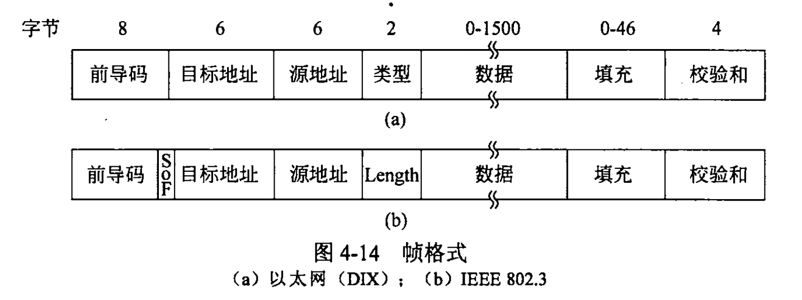
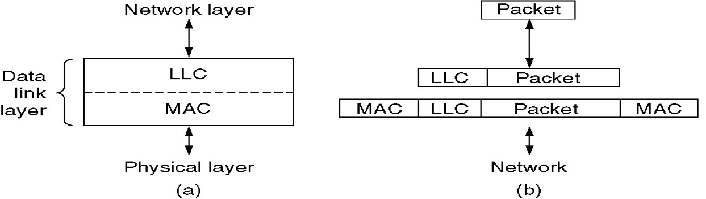
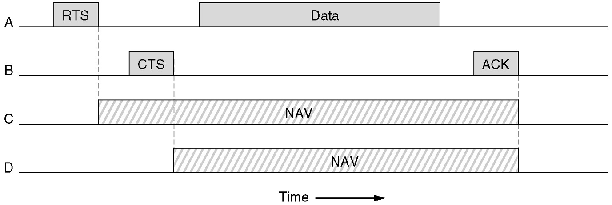
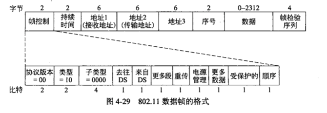
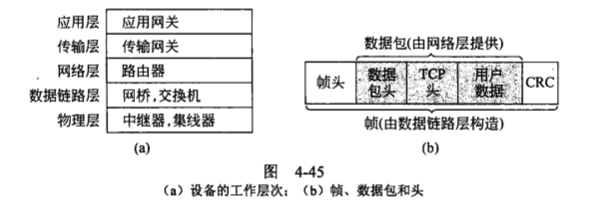

网络链路可以分成两大类
- 使用点到点连接。
- 使用广播信道。

广播信道又被称为：
- 多路访问信道(*multiaccess channel*)。
- 随机访问信道(*randomaccess channel*)。

介质访问控制(*MAC，Medium Access Control*)子层
- 数据链路层的底层部分
- **用来确定多路访问信道下一个使用者的协议属于数据链路层的一个子层**
- 在局域网(*LAN*)中十分重要，WAN(广域网)，MAN(城域网)
- 要解决的问题：谁传输数据？

## 局域网(*LAN*)和城域网(*MAN*)中的静态信道分配

多个竞争用户之间分配单个信道的传统做法是把信道容量拆开分给多个用户
- defect：如果频谱被分成N个区域，但是只有少于N个用户需要进行通信，大量宝贵的频谱资源被浪费。
- 平均时延(发送时间+排队时间)
- 
- 信道容量 **c** bit/s, 这里 c 是网络速度。
- 到达率是 **λ** frames/s。
- 帧长 drawn from(服从） 指数概率密度函数, 平均是 1/μ 位/帧。

--------------------------------------------------------------------

FDM(频分多路复用〉的平均时延： T_FDM = N*T
- N：FDM子信道的数目
- 每个子信道的平均到达率为λ/N
- c/N:子信道的容量
- T_FDM = 1 / (μc/N-λ/N) = N / (μc-λ)
- T：FDM之前的原始帧平均延迟
- 静态FDM的表现很差，TDM也是这样

## 局域网(*LAN*)和城域网(*MAN*)中的动态信道分配

5 个关键假设：
- 流量独立( *independent traffic* )
  - N个独立的站，如计算机，电话等，生成帧，等待传输，直到帧成功传输
- 单信道(*Single Channel*)
  - 所有的传输都用这一个信道
- 冲突可观察 (*observable Collision*)
  - 所有的站都能够检测到冲突事件的发生。冲突的帧必须在以后再次被发送。
- 时间连续或分槽(*Continuous or sloted time*)
  - 任何时刻都可以开始传输帧
  - 帧的传输只能从某个时间槽的起始点开始。一个时间槽可能包含 0、1或者多个帧，分别对应于空闲的时间槽、一次成功发送，或者一次冲突。
- 载波侦昕或不昕( *Carrier Sense or no carrier sense*)
  - 使用前，站可以分辨信道是否在使用中
  - 只有在以后才能确定传输是否成功

## 多路访问协议

### ALOHA

- ALOHA(*Additive Link On-Line Hawaii system*)
- 纯ALOHA
  - 基本思路：当用户有数据需要发送时就传输。(假定帧固定长度)
  - 冲突后，等待任意时间，然后重传
  - 阴影框的脆弱时期
  - The throughput of system: S=G*^(-2G)
    - G---Load,  total generated mean frame numbers(old and new) per frame time
    - S---successfully transmitted frames per  frame time, S≦1
  - 最大的吞吐量出现在当 G=0.5 时， S = 1/2e, 大约等于 0.184
  - 我们可以希望的最好信道利用率为 18%
  
- 分槽ALOHA
- 基本思想：将时间分为离散间隔，每个间隔对应一帧。
- 这种方法要求用户遵守统一的时间槽边界。
- 冲突的危险减小了一半
- The throughput : S=Ge^(-G)   
- 分槽 ALOHA 的尖峰在 G=1 处，此时吞吐量为 S=1/e，大约等于 0.368，是纯 ALOHA 的两倍
- 我们可以希望的最好信道利用率为 37%

### 载波侦听多路访问协议(*Carrier Sense Multiple Access Protocols*)

基本思想：
- 检测其他站正在做什么，并相应地调整其行为，以实现更好的利用率
- 载波侦听协议(*carrier sense protocol*)

#### 坚持和非坚持CSMA(载波检测多路访问, *Carrier Sense Multiple Access*)

1-坚持CSMA：
- 侦听信道，确定当时是否有其他站正在传输数据:如果信道空闲，立即发送数据。
- 否则，如果信道忙，该站等待直至信道变成空闲，然后，站发送一帧。
- 如果发生冲突，该站等待一段随机的时间，然后再从头开始上述过程。
- 信道空闲时，传输数据的概率是1。

非坚持CSMA：
- 侦听信道，如果信道忙，等待一段随机时间，然后开始侦听。
- 如果信道空闲，立即发送数据。
- 比1-坚持CSMA更好的信道利用率。

p-坚持CSMA：
- 侦听，如果信道空闲，它按照概率p发送数据，而以概率 q=1-p，将此次发送推迟到下一个时间槽。
- 信道为忙，则它等到下一个时间槽。

#### 带冲突检测的 CSMA

- 改进：一旦检测到冲突，就终止传输。
- 经典以太局域网的基础。
- 竞争期，传输期，空闲期。

在标记为t0的点，一个站己经完成了帧的传送，其他需要发送帧的站现在可以试图发送了。
如果有两个或者多个站同时进行传送，冲突就会发生。
如果一个站检测到冲突，它立即中止自己的传送，等待一段随机时间，然后再重新尝试传送(假定在此期间没有其他站己经开始传送）。

#### 无线局域网协议(*Wireless LAN Protocols*)

- 不同于蜂窝网络，每一个cell只有一个信道，覆盖了整个可用的带宽，通常是11Mb/s-54Mb/s。
- 隐藏终端问题Hidden station problem：
  - A->B, C不会侦听到A，因为A在它的覆盖范围之外，因此错误地得出结论，C可以传输，冲突发生。
- 暴露终端问题Exposed station problem：
  - B->A, C 侦听介质，它会听到有一个传输正在进行，从而会错误地得出结论:它不能向 D 发送数据。

冲突避免多路访问 （*MACA, Multiple Access with Collision Avoidance*)
- 基本思想：发送方剌激（*RTS*)接收方输出一个短帧(*CTS*)，以便其附近的站能检测到该次传输，从而避免在接下去进行的(较大)数据帧传输中也发送数据。

#### 结论（CSMA／CA规则）：

- 如果X站收到了A的RTS，则X必须在短时间内保持沉默，以使X不会干扰A收到CTS。
- 如果X站收到了RTS，但没有收到CTS，则X可以传输其数据，并且不会干扰其他站。
- 如果站X尚未收到RTS，但收到了CTS，则X可能不会发送其数据。
- 如果X站同时接收到RTS和CTS，则X可能不会发送其数据。
- 尽管使用RTS和CTS会降低网络效率，但是由于它们很短，因此影响很小。 例如，RTS的帧长度为30字节，而数据帧的最大长度为2346字节。
- MACA无法阻止冲突的发生，例如，A和C同时向B发送RTS，它们的RTS帧将发生冲突。
- MACAW（*MACA for Wireless*）：调整MACA以改善其性能。
- 在每个成功的数据帧之后引入一个ACK，重新传输以避免丢失该帧。

## Ethernet以太网

### Manchester Encoding

曼彻斯特编码：每个位周期均分为两个相等的间隔（1-第一个间隔为高，第二个间隔为低； 0-相反）。
- 优点：易于接收者与发送者同步
- 缺点：带宽是直接二进制编码的两倍

差分曼彻斯特编码(*Differential Manchester encoding*)：
- 1-间隔开始时没有传输，0-在间隔开始时存在过渡
- 差分方案需要更复杂的设备，但具有更好的抗噪能力
- high signal is +0.85V and low signal is -0.85V

### 以太网 MAC 子层协议

原始以太网(*DIX*)帧格式：
- 8字节的前导码 (*Preamble*)，每个字节包含比特模式 10101010。
- 单播，组播，广播
- 目的地址的高位：0-普通，1-组
- 最小帧长度：64个字节
  - 从垃圾中区分有效帧 
  - 碰撞检测
- CRC校验

### 二进制指数后退的CSMA/CA(*The Binary Exponential Backoff Algorithm*)

- delay=k*2τ
- slot time（往返延迟）：2τ= 51.2μs
- i第 i次冲突之后，选择0到2^i-1之间的随机数k
- 达到10次冲突后，随机间隔被冻结为最多1023个slots
- 在16次冲突之后，控制器放弃努力，并给计算机返回一个失败报告。

### 快速以太网(*fast Ethemet*)

光纤分布式数据接口 (*FDDI, Fiber Distributed Data Interface*)

### 千兆以太网(*gigabit Ethemet*)

### IEEE 802.2: Logical Link Control  逻辑链路控制

- 尽力而为数据报服务被广泛使用：IP数据包可以插入802帧的有效负载字段中。
- 在某些情况下，需要可靠的通信：LLC。
- **LLC**（逻辑链接控制）：数据链接层的上半部分

服务选项：
- 不可靠的数据报服务
- 确认数据报服务
- 可靠的面向连接的服务

## 无线局域网

- The 802.11 Protocol Stack
- The 802.11 Physical Layer
- The 802.11 MAC Sublayer Protocol
- The 802.11 Frame Structure
- Services
- 无线局域网的主要标准是 802.11。

### 802.11 体系结构和协议栈

- MAC子层决定信道怎样划分
- LLC子层隐藏了802系列协议之间的差异

### 802.11 MAC子层协议

无线传输的问题：
- 隐藏终端问题
- 暴露终端问题
- 半双工，无法在单个频率上同时发送和侦听噪声突发

两种操作模式：
- 分布式协调功能( *DCF, Distributed Coordination Function*)
  - 每个站独立行事，没有任何一种中央控制机制。
- 点协调功能(*PCF, Point Coordination Function*)
  - 使用基站控制覆盖范围内的所有活动
- DCF必须支持，PCF可选的

CSMA/CA(CSMA with Collision Avoidence): 
- employs DCF, uses both physical and virtual channel sensing 
- 方法1:senses channel
  - 如果空闲，就开始传输，传输的过程中不感知信道
  - 如果发生冲突，等待随机时间，使用以太网二进制指数后退算法
  - 被用来传输RTS帧
- 方法2:基于MACAW，使用虚拟信道侦听

网络分配向量( *NAV, Network Allocation Vector*)
- 每个帧携带一个 NAV 宇段，说明这个帧所属的一系列数据将传输多长时间。

- A想要发送给B，C是在A范围内的一个站，D是在B范围内的一个站
- C-----A-----B-------D
- A发送RTS帧给B来请求允许，B发送回CTS帧以授予许可。 然后，A发送数据，并启动一个ACK计时器。
- C收到了RTS帧 ----->  assert（声明）虚拟信道忙，NAV指示的。
- D收到了CTS帧，声明NAV

- 无线网络嘈杂且不可靠。 如果帧太长，很难通过完好无损。
- 片段：使用停止等待协议分别编号和确认。 片段爆裂。
- 片段通过将重传限制为坏片段而不是整个帧来提高吞吐量。

PCF模式：polling，no collisions
- 基站定期广播信标帧(beacon frame)
  - 每秒10-100次
  - 包含跳变序列，停留时间……
  - 站进行轮询，将带宽分配给它们
- power management：通知基站休眠

PCF和DCF共存：
- 短帧间间隔 (*SIFS, ShortInter Frame Spacing*)
  - 允许一次对话的各方具有优先抓住信道的机会
    - CTS (response to an RTS)
    - ACK for data
    - next fragment without a RTS.
- PIFS（PCF帧间间隔）：在PIFS之后，基站有机会抢占信道。
- DCF 帧间隔(*DIFS, DCF InterFrame Spacing*)。任何站都可以在介质空闲 DIFS 后尝试抓取信道发送一个新帧。
- 扩展帧间间隔(*EIFS, Extended InterFrame Spacing*)，仅用于一个站刚刚收到坏帧或未知帧后报告问题。

### 802.11 帧结构

- 帧控制 (Frame Control)字段。11 个子字段。
  - 协议版本(Protocol Version)
  - 类型(Type)字段(比如数据帧、控制帧或者管理帧)
  - 子类型(Subtype)字段(比如 RTS 或者 CTS)。
  - 去往 DS (To DS)
  - 来自 DS (From DS)标志位分别表明该帧是发送到或者来自于与AP 连接的网络，该网络称为分布式系统。
  - 更多段( More Fragment)标志位意味着后面还有更多的段。
  - 重传(Retry) 标志位表明这是以前发送的某一帧的重传。
  - 电源管理 (Power management)标志位指明发送方进入节能模式。
  - 更多数据(More data)标志位表明发送方还有更多的帧需要发送给接收方。
  - 受保护的(Protected Frame)标志位指明该帧的帧体己经被加密。
  - 顺序( Order)标志位告诉接收方高层希望严格按照顺序来处理帧序列。
- 持续时间(Duration)宇段，它通告本帧和其确认帧将会占用信 道多长时间，按微秒计时。
- 地址字段：source and destination, and two others for base station。
- 序号(Sequence)字段是帧的编号，可用于重复帧的检测。

## 数据链路层交换

采用称为网桥(bridge)的设备来连接局域网。

网桥检查数据链路层地址来转发帧，可以传输IPv4，IPv6，AppleTalk，ATM等。

网桥
- 工作在链路层，知道MAC帧结构
- 根据MAC帧的目的地址对收到的帧进行转发。当一个单播帧帧到达时，网桥并不是向所有的端口转发此帧，而是先检查其目的MAC地址，然后再确定将该帧转发到哪一个端口。
- 当一个广播帧帧到达时，网桥向所有的端口转发此帧
- 网桥只适合于用户数不太多(不超过几百个)和通信量不太大的局域网，否则有时还会产生较大的广播风暴。
- 路由器可以阻断广播风暴。
- 站表（转发表）与路由表不同，其目的地址是MAC地址，后者的目的地址是IP地址。

把一个物理局域网看成多个逻辑局域网，这种技术称为虚拟局域网 (*VLAN, Virtual LAN*).

一旦网络接口崩溃或被错误配置后，将会产生无休止的广播帧流。如果网络真的不走运，这类帧中一些会导致更多的流量。这种广播风暴(*broadcast storm*)的后果是:
- (1) 整个 LAN 的容量全部被这些帧占用:
- (2)所有这些互连 LAN 上的所有机器将忙于处理和丢弃所有被广播的帧。

