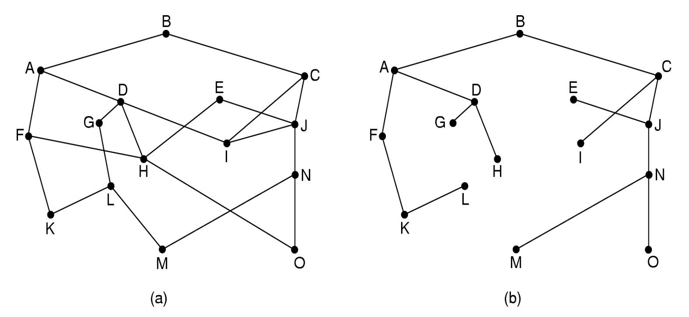
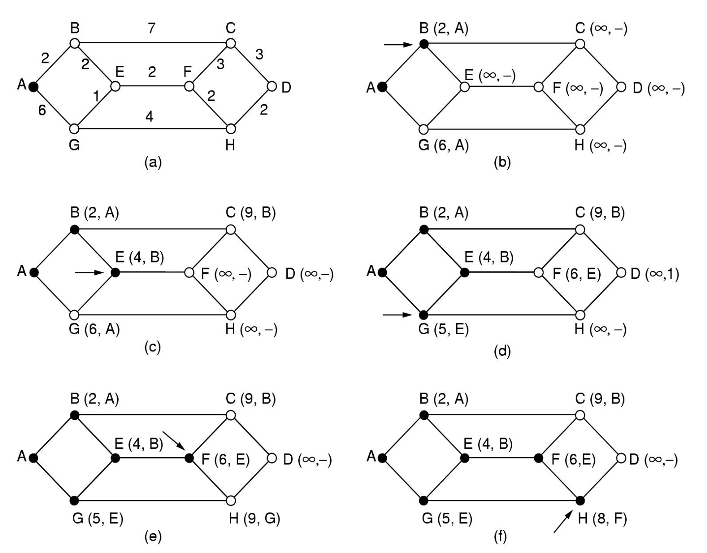
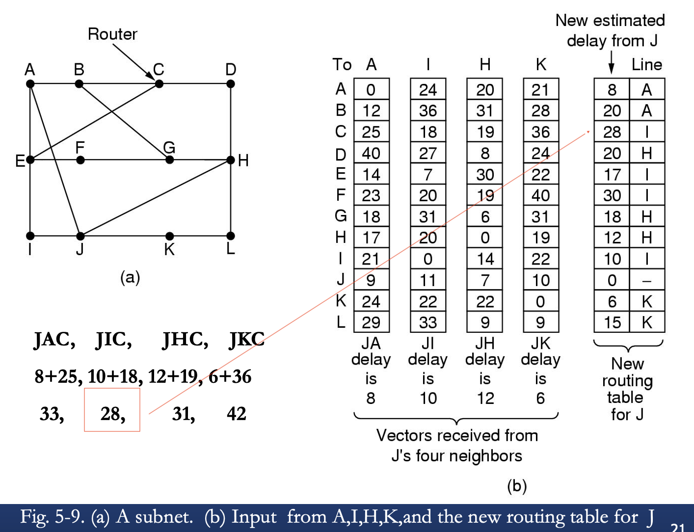

网络层是处理端到端数据的最底层。

数据链路层，只是将帧从线路一边传送到另一边。

# 网络层的设计问题

## 提供给传输层的服务

- 设计目标
  - 服务应该独立于子网技术
  - 传输层应与存在的子网的数量，类型和拓扑隔离
  - 网络地址应使用统一编号计划

- 面向连接的和无连接的服务
  - 两个交战派系
    - 网络公司：无连接
    - 电话公司：有连接
  - 争论点在于：网络层该提供无连接服务还是有连接服务

## 无连接服务的实现

无连接服务：
- 数据包通常称为数据报(*datagram*)
- 对应的网络称为数据报网络(*datagram network*)

面向连接的服务：
- 在发送数据包之前，必须首先建立起一条从源路由器到目标路由器之间的路径。这个连接称为虚电路(*VC, virtual circuit*)
- 对应的网络称为虚电路网络(*virtual-circuit network*) 

每一台路由器都有一个内部表，它指明了针对每一个可能的目标地址应该将数据包送到哪里去。每个表项由两部分数据组成：目标地址和通往目标地址所使用的出境线路。

IP协议(*Internet Protocol*)是整个 Internet 的基础，它是无连接网络服务的重要范例。 每个数据包携带一个目标 IP地址，路由器使用该地址来单独转发每一个数据包。 

IPv4数据包的地址是32位， IPv6 数据包的地址是128位。

## 面向连接服务的实现

- 虚电路：避免给每个要发送的数据包选择一条路径
- 当建立一个连接时，从源机器到目标机器之间的一条路径就被当作这个连接的一部分确定了下来，并且保存在这些中间路由器的表中。

# 路由算法

- 功能：负责确定一个入境数据包应该被发送到哪一条输出线路上。

路由的两个功能：
- 转发(*forward*)：处理每个输入包搜索路由表，，然后转发到出境路线上。
- 生成和更新路由表。

路由算法：
- 数据报和vc的区别：自上次在数据报子网中以来，最佳路由可能已更改。
- 理想性能：
  - 正确性，简单性，鲁棒性，稳定性，公平性和最优性(correctness、simplicity、robustness、stability、fairness and optimality)
  - 公平与最优之间的冲突：为使总流量（A–A'，B–B'，C–C'）最大化，应关闭X到X'流量。 不公平！
- 算法：两类：
  - 非自适应算法-〉静态路由
  - 自适应-〉动态路由

## 优化原则

最优路径的一般陈述如下：  
如果路由器J在从路由器I到路由器K的最优路径上，那么从J到K的最优路径也必定遵循同样的路由。

作为最优化原则的一个直接结果，从所有的源到一个指定目标的最优路径的集合构成了一棵以目标节点为根的树。这样的树称为汇集树(*sink tree*).

汇集树不一定是唯一的。

## 最短路径算法

- 测量路径长度的一种方法
  - 跳数，物理距离，带宽、平均流量、通信成本，平均延迟，平均队列长度……

Dijkstra’s algorithm：The shortest path from A to D
- 从A到D的最短路径
- 1：初始化，将节点A标记为永久性，用实心圆表示。
- 2: 依次检查每一个与 A (工作节点)相邻的节点，并且用它们与 A 之间的距离重新进行标记。为了可以重构出最终路径，每当一个节点被重新标记时，也要标记出这次探测动作的出发节点(即前一个节点)。
- 3：检查所有与 B 相邻的节点。对于每一个与 B 相邻的节点，如果节点 B 上的标记加上从 B 到该节点的距离小于该节点原来的标记，说明我们找到了一条更短的路径，所以需要重新标记该节点。
- 4: 算法需要对整个图进行搜索，找到具有最小标记值的暂时性节点。这个节点的标记将变成永久性， 并且成为下一轮的工作节点。图 5-7显示了算法的前 6个步骤。
  

## 泛洪算法(*flooding*)

- 在实现路由算法时，每个路由器必须根据本地知识而不是网络的全貌做决策。
- 泛洪(*flooding*)技术将每一个入境数据包发送到除了该数据包到达的那条线路以外的每条出境线路。
- question：产生大量重复的数据包
- solutions：
  - 1: 在每个数据包的头中设置一个跳计数器，每经过一跳该计数器减一，当计数器到达 0 时就丢弃该数据包。
  - 2：每个路由器节点都跟踪哪些数据包已被泛洪，以避免再次发送它们。
- 选择性的泛洪：
  - 仅在大致正确方向上的线路上发送每个入境数据包。
- 在大多数应用中没有实践。

## 距离矢量算法 RIP协议

原理：
- 每个路由器维护一个表，每个其他路由器在表中都有一个entry。
- entry包含两个向量：到目标路由器的距离（距离向量）和传出线路（下一节点向量）。
- 距离的度量可以是：跳数hop，延迟等。
- 更新路由表：与**邻居**交换距离矢量，根据收集到的所有距离矢量进行计算，更新
- 应用范围：ARPANET，Internet，DECNet，Novell IPX，Cisco路由器，其名称为**RIP**（路由信息协议）。

- TCP/IP：RIP的指标是跳数。
- 在RIP中，路由器节点的一部分是路由器，另一部分是子网。
- 数到无穷大问题
- 缺点：收敛缓慢。（好消息传播快，坏消息传播慢）

## 链路状态路由

每一个路由器必须完成以下的事情，算法才能正常工作:
- (1) 发现它的邻居节点，并了解其网络地址。 
- (2) 设置到每个邻居节点的距离或者成本度量值。 
- (3) 构造一个包含所有刚刚获知的链路信息包。 
- (4) 将这个包发送给所有其他的路由器，并接收来自所有其他路由器的信息包。 
- (5) 计算出到每个其他路由器的最短路径。

-------------------------
* 发现邻居

只需在每一条点到点线路上发送一个特殊的 HELLO 数据包。线路另一端的路由器应该返回一个应答说明自己是谁。

* 设置链路成本

通过线路给另一边发送一个特殊的 ECHO 数据包，要求对方立即发回。 
通过测量往返时间再除以2，发送路由器可以得到一个合理的延迟估算值。

* 构建链路状态包
  * 周期性地创建数据包
  * 每当发生某些重要的事情时才创建数据包

* 分发链路状态包

基本思路：使用泛洪法将链路状态数据包分发给所有路由器。每个数据包都包含一个序号，序号随着每一个新数据包发出而逐一递增。

当一个新的链路状态数据包到达时，路由器检查这个新来的数据包是否己经出现在上述观察到的列表中。如果这是一个新数据包，则把它转发到除入境线路之外的所有其他线路上。如果这是一个重复数据包，则将它丢弃。**如果数据包的序号小于当前所看到过的来自该源路由器的最大序列号，则它将被当作过时数据包而拒绝接受，因为路由器己经有了更新的数据。**

在每个数据包的序号之后包含一个年龄(age)字段， 并且每秒钟将年龄减 1。当年龄字段的值被减到 0 时，来自路由器的该信息将被丢弃。

改进：
- 链路数据包首先被放到一个保留区中等待一段时间。
  - 来自于同一个源路由器的链路状态数据包也到来了，那么就比较它们的序号。如果两个数据包的序号相等，则丢弃重复数据包。如果两者不相等，则丢弃老的数据包。
- 发送标志表明该数据包必须在所指示的线路上发送。
- 确认标志表明它必须在这条线路上得到确认。

* 计算新路由

Dijkstra algorithm

应用：
- OSPF
- IS-IS
- difference： IS-IS 可以携带关于多种网络层协议的信息。

# 服务质量

## 应用需求
